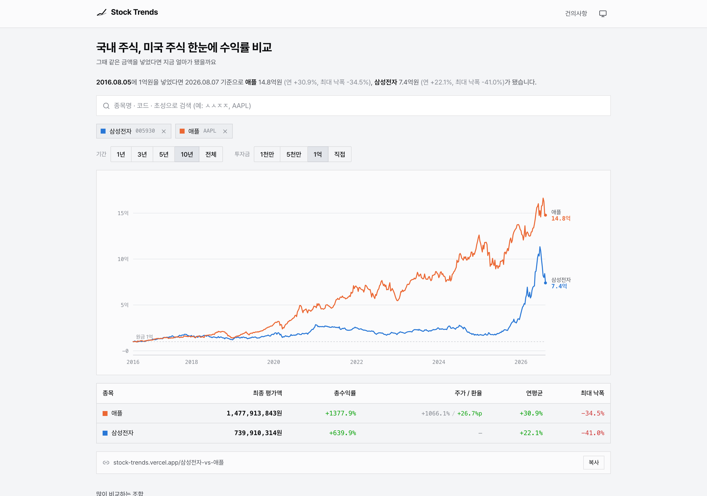

# Stock Trends — 주식 비교

npm trends의 주식 버전. **국내·미국 주식과 ETF의 수익률을 한 차트에 겹쳐** 비교합니다.

"그때 그 돈을 넣었으면 지금 얼마가 됐을까." 퍼센트가 아니라 **평가액**으로 답합니다.



## 기능

**동일 투자금 정규화** — 같은 날 같은 금액을 넣었다고 가정하고 평가액 곡선을 겹칩니다. 축이 `%`가 아니라 `원`이라 "1억이 14.8억이 됐다"가 바로 읽힙니다.

**한국·미국 한 화면** — 미국 종목은 **각 주차의 환율**로 환산합니다. 오늘 환율을 전 구간에 곱하면 곡선 모양이 달러 차트와 똑같아지고 눈금만 원화가 되는데, 그건 질문의 답이 아닙니다. 애플 10년 1억이 시점별 환율로는 14.4억, 오늘 환율 고정으로는 11.5억 — 3억 차이가 납니다. 그래서 총수익률을 **주가 기여분과 환율 기여분으로 분해**해 표에 같이 보여줍니다.

**최대 5종목**, 조합이 같으면 색도 항상 같습니다.

**빈 화면에서 시작해 하나씩 담습니다.** 첫 화면을 기본 조합으로 채우지 않는 건 URL 왕복을 대칭으로 두기 위함입니다 — `/`가 "종목 없음"을 뜻해야 종목을 다 지운 뒤 새로고침해도 같은 상태로 돌아옵니다. 검색어가 떠오르지 않으면 추천 칩을 눌러 바로 담을 수 있습니다.

**초성 검색** — `ㅅㅅㅈㅈ` → 삼성전자. 종목코드·티커·영문명도 됩니다.

**상장일 자동 정렬** — 늦게 상장한 종목이 끼면 구간이 자동으로 좁혀지고, 왜 좁아졌는지 화면에 남깁니다.

**공유 URL** — `/삼성전자-vs-애플`. 별칭(`/samsung-vs-aapl`)은 308로 정본에 모읍니다.

**최대 낙폭(MDD)과 연평균 수익률(CAGR)** — 수익률만 보면 안 보이는 "가는 동안 얼마나 아팠는지"를 같이 냅니다.

그 밖에 다크모드, 종목별 OG 카드, 건의사항 게시판(로그인 없음), 4,600여 페이지 사전 생성.

## 설계

**조회 시점에 외부 API를 호출하지 않습니다.** 주간 데이터라 한 달 내내 같은 배열을 반복해 읽을 뿐이라 DB가 할 일이 없습니다. 빌드 타임에 정적 JSON을 굽고 CDN에서 서빙합니다. 기간·투자금을 바꿔도 네트워크 요청이 없습니다 — 이미 받은 배열로 다시 계산할 뿐입니다.

전송량은 첫 로드 약 6KB + 종목당 2.5KB (gzip).

**주봉 그리드를 ISO 주차로 맞춥니다.** 한국은 주봉 바의 날짜가 그 주 마지막 거래일(금)이고 미국은 그 주 일요일입니다. 거래일 합집합으로 축을 만들면 매주 칸이 두 개 생겨 모든 계열이 계단형으로 망가집니다.

**완결된 주차만 발행합니다.** 진행 중인 주차를 포함하면 값이 매일 바뀌어 매 실행마다 2,000여 개 파일이 diff에 뜹니다.

## 데이터

| 항목     | 내용                                                 |
| -------- | ---------------------------------------------------- |
| 시세     | 네이버 금융 (국내 `siseJson` / 해외 `chart/foreign`) |
| 환율     | 네이버 매매기준율 — 2004년~                          |
| 해상도   | 주봉 (월봉은 중간 저점이 사라져 MDD가 얕게 나옵니다) |
| 범위     | 한국 2000년~, 미국 대체로 2010년~                    |
| 수정주가 | 액면분할·증자 **보정됨**                             |
| 배당     | **미반영** — 국내 수정주가 표준                      |
| 갱신     | 주 1회, 완결된 주차만                                |

### 유니버스 2,153종목

한국 주식 1,155 · 우선주 27 · 리츠 18 · ETF 300 / 미국 주식 550(**S&P 500 전 종목**) · ETF 98

없는 종목은 검색 결과에서 바로 요청할 수 있습니다. 종목코드나 티커면 **즉시 수신 가능 여부를 검증해 답합니다** — 지원하지 않는 종목을 일주일 기다린 끝에 알게 되는 게 최악이라서요. 중복 요청은 새 행이 아니라 득표로 쌓여 추가 우선순위가 됩니다.

## 실행

```bash
pnpm install
cp .env.local.example .env.local   # 비교 페이지는 값 없이도 동작합니다

pnpm dev
pnpm test        # 96건
pnpm build

pnpm data:all    # 환율 → 시세 → 슬러그 → 검증
```

## 구조

```
data/                  빌드 입력 (커밋, 배포 제외)
├── universe.json      2,153종목 — 사람이 읽고 편집하는 진실의 원천
└── cache/             환율 원본 · 심볼 해석 캐시
public/data/           산출물 (커밋 + CDN 배포)
├── meta.json          주차 그리드 + 환율
├── tickers.json       검색 목록
├── kr/{종목코드}.json   원화 주간 종가
└── us/{티커}.json      달러 주간 종가
scripts/               데이터 파이프라인 (.mjs)
src/                   Next.js 앱
tests/                 lib · integration · scripts
```

## 자동화

| 워크플로               | 주기         | 내용                                        |
| ---------------------- | ------------ | ------------------------------------------- |
| `data-weekly.yml`      | 토 13:00 KST | 시세·환율 갱신 → 검증 → 변경 있을 때만 커밋 |
| `universe-monthly.yml` | 매월 1일     | 유니버스 재생성 → PR (자동 병합하지 않음)   |

`verify.mjs`를 통과해야 커밋합니다 — 성공률 95% 미만, 그리드 결손, 환율 구멍, 슬러그 충돌, 과거 구간 대량 재작성 중 하나라도 걸리면 멈춥니다. 반쪽 데이터를 발행하지 않는 것이 목적입니다.

## 고지

이 사이트는 과거 데이터를 비교해 보여줄 뿐 **투자를 권유하지 않습니다.** 과거 수익률은 미래를 보장하지 않으며, 세금·거래비용·배당은 반영되지 않았습니다.

데이터 출처에 관한 문의나 이용 중단 요청은 [umseonjgun@naver.com](mailto:umseonjgun@naver.com)으로 알려주시면 신속히 조치하겠습니다.
